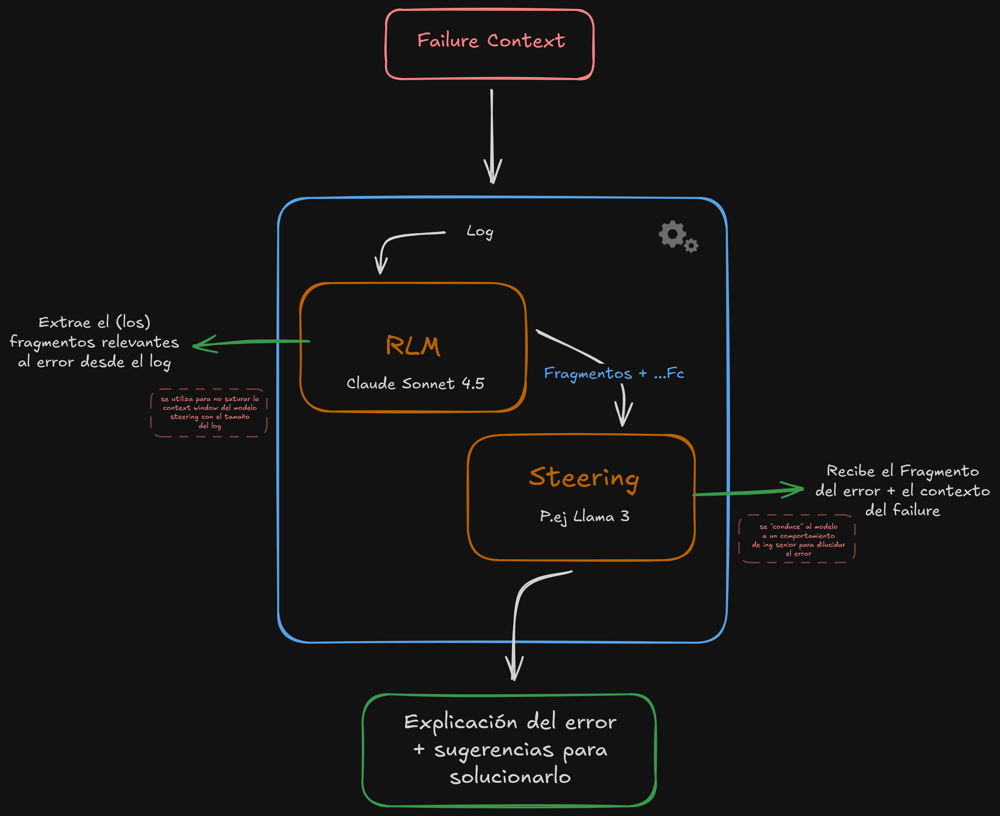

# Documentación del Modelo de Datos: GitHub Actions y Failure Context

Este documento define las entidades utilizadas para representar la ejecución de flujos de trabajo en GitHub Actions, así como la estructura agregada denominada "Failure Context" para el análisis de errores.

## Entidades de GitHub Actions

### Workflow (GHWorkflow)

Representa la definición de un flujo de trabajo automatizado. Es la unidad contenedora de alto nivel.

- **ID:** Identificador único del workflow.
- **nodeID:** Identificador del nodo en el grafo de GitHub (distinto al ID numérico).
- **path:** Ruta relativa del archivo de configuración dentro del repositorio (ej. `.github/workflows/pull_request_stats.yml`).
- **runs:** Lista de ejecuciones asociadas (lista de entidades `GHRun`).

> **Relación:** Un `Workflow` se compone de múltiples `Runs`, ya que estos últimos representan las instancias de ejecución concretas de la definición del workflow.

### Run (GHRun)

Representa una ejecución instanciada de un Workflow. Una ejecución puede constar de uno o más intentos (re-intentos).

- **ID:** Identificador único del run.
- **name:** Nombre del workflow (personalizable).
- **displayTitle:** Título visible de la ejecución. Por defecto corresponde al mensaje del commit o título del PR, pero es personalizable.
- **nodeID:** Identificador del nodo.
- **runNumber:** Número secuencial de la ejecución.
- **workflow:** Referencia al `GHWorkflow` padre.
- **actor:** Responsable del evento que gatilló la ejecución (entidad `GHActor`).
- **commit:** Commit asociado a la ejecución (entidad `GHCommit`).
- **attempts:** Lista de intentos de ejecución (lista de entidades `GHRunAttempt`).
- **updatedAt:** Fecha de la última actualización del estado del run.
- **conclusion:** Estado final de la ejecución. Posibles valores:

  - `success`: La ejecución finalizó correctamente.
  - `failure`: La ejecución falló.
  - `neutral`: Finalizó neutralmente; tratado como éxito para verificaciones dependientes.
  - `skipped`: El run, job o paso fue omitido (bypassed), usualmente por condiciones lógicas.
  - `timed_out`: La ejecución excedió el límite de tiempo permitido.
  - `action_required`: Se requiere intervención manual para completar la ejecución.

- **status:** Estado actual del ciclo de vida de la ejecución. Posibles valores:
  - `queued`: En cola, esperando ser procesado.
  - `waiting`: Esperando que se cumpla una condición previa o aprobación.
  - `pending`: Esperando reporte de estado.
  - `in_progress`: Actualmente en ejecución.
  - `requested`: Creado pero aún no en cola.
  - `completed`: Finalizado (posee una `conclusion`).

### Attempt (GHRunAttempt)

Representa un intento específico de completar un `Run`.

> **Nota de Contexto:** Aunque el `Run` representa la ejecución lógica, el `Attempt` representa la ejecución técnica. Si un Run falla y se reintenta ("re-run"), se genera un nuevo `Attempt` bajo el mismo `Run`. Los Jobs y Logs son propiedades específicas de un `Attempt`.

- **run_attempt:** Número secuencial del intento (inicia en 1).
- **status:** Estado del intento (mismos valores definidos en `GHRun`).
- **conclusion:** Conclusión del intento (mismos valores definidos en `GHRun`).
- **startedAt:** Marca de tiempo de inicio del intento.
- **updatedAt:** Marca de tiempo de la última actualización de estado.
- **jobs:** Lista de trabajos ejecutados en este intento (lista de entidades `GHJob`).

### Job (GHJob)

Corresponde a un conjunto de pasos (`Steps`) que se ejecutan en un mismo ejecutor (_runner_). Es la unidad de procesamiento que se asigna a una máquina virtual o contenedor.

- **id:** Identificador único del job.
- **name:** Nombre del job según definición en el archivo YAML.
- **nodeId:** Identificador del nodo.
- **runAttempt:** Referencia al número de intento asociado.
- **status:** Estado actual del job.
- **conclusion:** Conclusión del job.
- **startedAt:** Inicio de la ejecución del job.
- **completedAt:** Término de la ejecución del job.
- **dependencies:** Lista de otros jobs que deben finalizar antes de que este inicie.
- **fullLog:** Ruta o contenido del log completo asociado al job (generalmente en formato `.txt`).
- **steps:** Lista de pasos individuales dentro del job (lista de entidades `GHStep`).

### Step (GHStep)

Unidad atómica de trabajo dentro de un Job. Representa una acción individual o un comando de shell.

- **name:** Nombre del paso definido en el YAML.
- **number:** Número secuencial que determina el orden de ejecución.
- **startedAt:** Momento de inicio.
- **completedAt:** Momento de término.
- **status:** Estado del paso.
- **conclusion:** Conclusión del paso (ej. `success`, `failure`, `skipped`).
- **log_path:** (Opcional) Ruta al archivo de log específico del paso.
- _Nota:_ Frecuentemente, los logs se proveen como un único archivo monolítico a nivel de Job, lo que dificulta el parseo preciso por Step individual. Este campo se utiliza solo si el formato de logs permite la subdivisión.

### Actor (GHActor)

Entidad que representa al usuario o bot que inició el evento (Pull Request, Push, etc.) que desencadenó el workflow.

- **name:** Nombre de usuario.
- **email:** Correo electrónico asociado.

### Commit (GHCommit)

Representa la instantánea del código (commit) sobre la cual se está ejecutando el workflow.

- **id:** Hash del commit (SHA).
- **message:** Mensaje del commit.
- **timestamp:** Fecha y hora del commit.
- **authorName:** Nombre del autor del código.
- **authorEmail:** Correo del autor del código.
- **treeId:** Identificador del árbol de archivos git.

---

## Entidades de Repositorio y Código Fuente

### Repository (GHRepository)

Representa el almacén de código, metadatos y configuración del proyecto. En este modelo de datos, la entidad `GHRepository` actúa como un agregado que no solo contiene la información base, sino también estadísticas, estructura de archivos y lenguajes.

Se compone de:

- **full_name:** Identificador único legible (slug) del repositorio en formato `owner/name` (ej. `expressjs/express`). Es la referencia principal para operaciones de clonado o API.
- **name:** Nombre corto del repositorio.
- **owner:** Entidad propietaria del repositorio (ver `GHOwner`).
- **description:** Descripción textual del propósito del proyecto.
- **default_branch:** Rama principal del repositorio (ej. `master`, `main`). Vital para entender contra qué se comparan los cambios o dónde se ejecutan los workflows por defecto.
- **visibility_flags:** Banderas booleanas que definen la accesibilidad:
- `is_private`: Si el repositorio es privado.
- `is_fork`: Si es una derivación de otro repositorio.
- `is_archived`: Si el repositorio está en modo solo lectura.

- **timestamps:** Marcas de tiempo críticas para el ciclo de vida:
- `created_at`: Creación del repo.
- `updated_at`: Última modificación de metadatos.
- `pushed_at`: Último _push_ de código recibido. Este dato es esencial para correlacionar si una ejecución de Action corresponde a la versión más reciente del código.

- **statistics:** Métricas de salud y popularidad del proyecto:
- `size`: Tamaño del repositorio en KB.
- `stargazers_count`: Número de estrellas (popularidad).
- `forks_count`: Número de derivaciones.
- `open_issues_count`: Cantidad de problemas abiertos (puede indicar deuda técnica).

- **urls:** Enlaces de acceso (`html_url` para navegador, `clone_url` para git).
- **languages:** Desglose de tecnologías utilizadas (ver `GHLanguages`).
- **file_tree:** Estructura de archivos del repositorio (ver `GHFileTree`).
- **topics:** Lista de etiquetas o temas asociados (ej. `nodejs`, `server`).

### Owner (GHOwner)

Entidad que posee el repositorio. Puede ser un usuario individual o una organización.

- **login:** Nombre de usuario u organización.
- **type:** Tipo de cuenta (Valores comunes: `User`, `Organization`).

### Languages (GHLanguages)

Representa la composición tecnológica del repositorio. Útil para que un agente de IA infiera el entorno de ejecución (ej. si ve TypeScript, esperará un paso de compilación; si ve Python, buscará `requirements.txt`).

- **primary_language:** El lenguaje predominante en el repositorio.
- **breakdown:** Diccionario o lista que relaciona el lenguaje con la cantidad de código (bytes o líneas) y su porcentaje representativo (ej. `JavaScript: 99.89%`).

### File Tree (GHFileTree)

Representación jerárquica o plana del contenido del repositorio en un momento dado (snapshot). Permite a un agente "ver" la estructura del proyecto sin clonarlo.

- **sha:** Hash del árbol (tree) raíz.
- **files:** Lista de objetos que representan archivos individuales (`blobs`). Cada elemento contiene:
- `path`: Ruta relativa del archivo (ej. `.github/workflows/ci.yml`).
- `size`: Tamaño en bytes.
- `sha`: Hash del contenido del archivo.
- `url`: Enlace para descargar el contenido crudo (blob).

- **directories:** (Opcional/Derivado) Lista de carpetas (`trees`) si la estructura se presenta separada.

> **Nota de Implementación:** En el JSON típico de un repo, el `file_tree` parece ser una instantánea recursiva (recursive tree). Esto es muy potente para un `Failure Context`, ya que permite verificar la existencia de archivos de configuración (`package.json`, `.eslintrc`, etc.) sin realizar llamadas API adicionales.

### Contributors (GHContributor)

Lista de personas que han aportado código al repositorio.

- **login:** Nombre de usuario.
- **contributions:** Cantidad de commits aportados.
- **type:** Tipo de usuario (User/Bot). Importante para distinguir si un cambio fue hecho por un humano o un proceso automatizado (ej. `dependabot`).

Aquí tienes la reescritura del texto en tercera persona, con un tono formal y objetivo, ideal para incluirlo como una nota de arquitectura o justificación técnica en la documentación:

### Análisis del Impacto en el Failure Context

Si bien la integración de la entidad `GHRepository` en el `Failure Context` aún no se ha incluido, su futura inclusión aportaría capacidades críticas para el análisis automatizado de errores, destacando dos beneficios principales:

1. **Inferencia de Contexto Tecnológico:** Permite al agente o sistema de análisis deducir el entorno de ejecución correcto basándose en la estructura del proyecto. Por ejemplo, ante un fallo en una fase de construcción (_build_), el acceso al `primary_language` y a la existencia de archivos específicos en el `file_tree` (como `yarn.lock`) permitiría determinar que el comando adecuado es `yarn install` en lugar de `npm install`, mejorando la precisión de la solución propuesta.

2. **Validación de Cronología y Estado:** Habilita el diagnóstico de problemas temporales. La comparación entre la marca de tiempo `pushed_at` del repositorio y el `startedAt` del `GHRun` facilita la detección de condiciones de carrera (_race conditions_), permitiendo identificar si el flujo de trabajo se ejecutó sobre una versión del código que ya no correspondía al estado más reciente (versión desactualizada).

---

## Nueva Entidad: Failure Context

El **Failure Context** se define como una entidad de primera categoría diseñada para encapsular toda la información contextual necesaria para el análisis de un fallo. Actúa como un agregador que vincula la jerarquía de ejecución con el código responsable.

Esta entidad permite entender no solo _qué_ falló, sino _dónde_, _cuándo_ y _quién_ realizó el cambio asociado. Se compone de:

1. **Workflow:** Contexto de la definición del proceso.
2. **Run:** Contexto de la ejecución lógica.
3. **Attempt:** Contexto del intento específico donde ocurrió el fallo.
4. **Job:** La unidad de procesamiento y máquina donde ocurrió el error.
5. **Step:** La instrucción atómica específica que detonó el fallo.
6. **Commit:** El cambio de código asociado al Run (punto en la historia).
7. **Author/Committer:** Responsable del cambio (para notificaciones o asignación de responsabilidad).
8. **Log:** Registro textual de la ejecución.

- _Especificidad:_ Los logs se generan a nivel de `GHJob` pero se versionan y asocian a un `GHAttempt` específico, permitiendo aislar el error exacto del intento fallido.

---

## Arquitectura Inicial

El siguiente diagrama ilustra la arquitectura de alto nivel propuesta para el sistema de análisis de fallos. Esta aproximación se basa en un diseño de **IA Compuesta** (Compound AI System), donde se orquestan modelos especializados para distintas etapas del procesamiento de la información.

### Descripción del Flujo

El sistema se alimenta de la entidad **Failure Context** (`Fc`), la cual encapsula toda la información del repositorio y la ejecución fallida. El procesamiento se divide en dos etapas críticas:

1. **Filtrado Inteligente (Capa RLM):**

- Utiliza un modelo con alta capacidad de razonamiento y agéntica (proyectado como **Claude Sonnet 4.5** o **Opus 4.5**) para implementar la técnica de _Recursive Language Models_ (RLM).
- **Objetivo:** Evitar la saturación de la ventana de contexto. El modelo inspecciona el log completo (que puede ser masivo) mediante código y extrae únicamente los fragmentos relevantes asociados al error raíz.

2. **Generación Controlada (Capa Steering):**

- Combina los fragmentos extraídos por el RLM con el resto de la metadata del `Failure Context` (como el lenguaje del repositorio o el historial del Run).
- Utiliza un modelo Open Source (ej. **Llama 3**) sobre el cual se aplica un _Steering Vector_ específico.
- **Objetivo:** "Conducir" la respuesta del modelo hacia un comportamiento de **Ingeniero Senior**, garantizando explicaciones técnicas, precisas y libres de la verborrea habitual de los modelos base.

### Estado de la Arquitectura y Próximos Pasos

Es importante destacar que esta arquitectura representa una **primera versión (v1) o Prueba de Concepto**. Existen componentes y metodologías que se encuentran en fase de investigación y definición:

- **Implementación Real del RLM:** Aunque se propone el uso de modelos avanzados como Claude Sonnet/Opus 4.5, aún es necesario validar empíricamente sus capacidades reales para la ejecución recursiva de código sobre logs de gran volumen y su fiabilidad al orquestar sub-agentes sin supervisión humana.
- **Identificación de Vectores de Steering:** La metodología exacta para extraer el vector de dirección adecuado sigue abierta. Se debe determinar si se utilizarán pares de prompts contrastantes (Difference-in-Means), Análisis de Componentes Principales (PCA) u otras técnicas emergentes para capturar fielmente el estilo de "Debug Expert" sin degradar otras capacidades del modelo.
